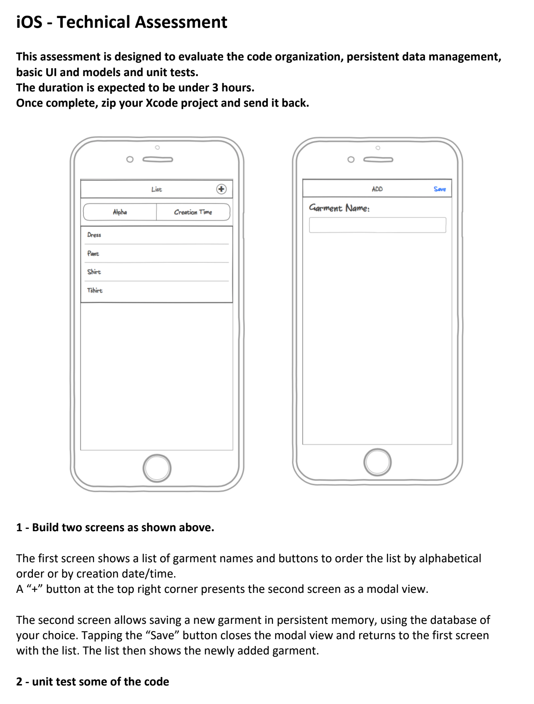

# LululemonChallenge

This repository's purpose is to solve the coding challenge from Lululemon.

Here is a description of the challenge:

I decided to use MVVM as the architecture for this application.  The data model is pretty simple in this scenario (just a garment name and the date it was created on), but I still believe that MVVM was the right approach since the controller and the views should have no knowledge of the underlying data structure.  They should only know about the view model.

This solution also uses programmatic UI whereby I use a custom extension on UIView to anchor UI elements on screen.